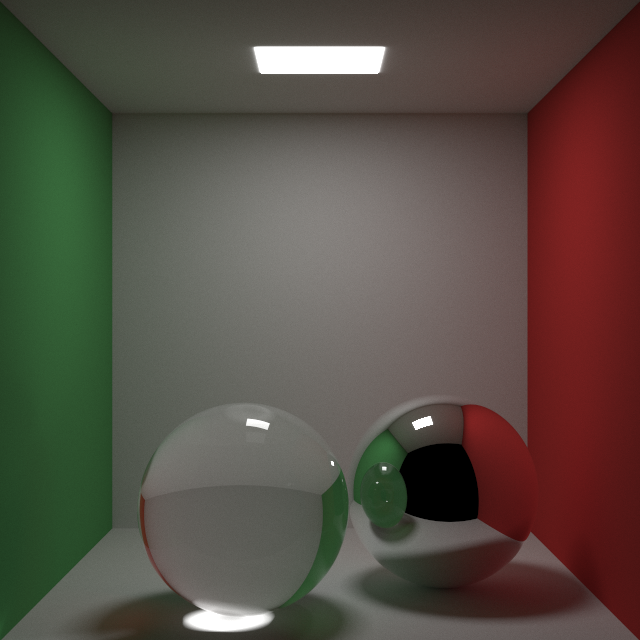

# rtxon
Yet another Rust raytracer implementation. The goal of this project is to familiarize myself with more intermidiate concepts in Rust such as traits, lifetimes, shared pointers and design patterns as well as learn a bit of Raytracing basics on the side. The source code is my implementation of [Ray Tracing in One Weekend](https://raytracing.github.io/books/RayTracingInOneWeekend.html) by Peter Shirley.


## Features
- Basic Materials (Lambertian, Metal, Dielectric, Emmisive)
- Shapes (Sphere, Rectangle, Triangle)
- Positionable Camera
- Anti Aliasing
- Depth of Field
- Motion Blur
- OBJ Import
- Cute progress bar when rendering

## Future Features
- Proper BHV implementation
- ~~Parallelism~~
- GUI progress indicator
- ~~OBJ Import~~
- HDR background for global illumination

## Rendering default scene
```bash
cargo run --release
```

## Renders
### 640x360, samples = 128 * 500, depth = 100, f = 0.05, ~22h (Ryzen 5950x)


### 1280x720, samples = 1024, depth = 100, f = 0.05, ~10min (M2 Macbook Pro)


### 640x360, samples = 512, depth = 100, f = 0.05, ~44s (M2 Macbook Pro)


### 640x360, samples = 512, depth = 100, f = 0.2, ~45s (M2 Macbook Pro)


### 640x360, samples = 512, depth = 100, f = 1.0, ~65s (M2 Macbook Pro)


### 640x360, samples = 128, depth = 100, f = 0.05, ~12s (M2 Macbook Pro)


### 640x360, samples = 512, depth = 100, f = 0.1, ~7min (M2 Macbook Pro)


## Command-line Arguments

```bash
$ rtxon --help
A Raytracer In One Weekend implementation

Usage: rtxon [OPTIONS]

Options:
  -s, --scene <SCENE>              Scene to render (default Cornell Box) [default: 9]
  -w, --width <WIDTH>              Size of the tuple in decimal digits [default: 600]
  -s, --samples <SAMPLES>          Samples per pixel [default: 128]
  -m, --max-depth <MAX_DEPTH>      Primorial offset [default: 100]
  -o, --output-path <OUTPUT_PATH>  Desired output location [default: output.png]
  -t, --threads <THREADS>          Threads [default: 1]
  -c, --chunks <CHUNKS>            Threadpool Chunks [default: 1]
  -h, --help                       Print help
  -V, --version                    Print version
```

### Render default scene with 10 threads
```bash
$ rtxon --output-path render.png --max-depth 100 --samples 128 --width 600 --threads 10 --chunks 10
```

### Render checker scene with 10 threads
```bash
$ rtxon --output-path render.png --scene 2 --max-depth 100 --samples 128 --width 600 --threads 10 --chunks 10
```