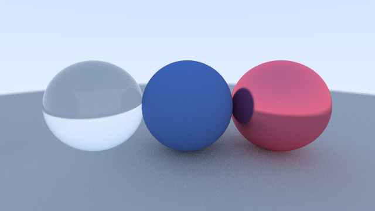

# rtxon
Yet another Rust raytracer implementation. The goal of this project is to familiarize myself with more intermidiate concepts in Rust such as traits, lifetimes, shared pointers and design patterns as well as learn a bit of Raytracing basics on the side. The source code is my implementation of [Ray Tracing in One Weekend](https://raytracing.github.io/books/RayTracingInOneWeekend.html) by Peter Shirley.


## Features
- Basic Materials (Lambertian, Metal, Dielectric, Emmisive)
- Shapes (Sphere, Rectangle, Triangle)
- Positionable Camera
- Anti Aliasing
- Depth of Field
- Motion Blur
- OBJ Import
- Cute progress bar when rendering

## Future Features
- Proper BHV implementation
- ~~Parallelism~~
- GUI progress indicator
- ~~OBJ Import~~
- HDR background for global illumination

## Rendering default scene
```bash
cargo run --release
```

## Renders
### 640x360, samples = 128 * 500, depth = 100, f = 0.05, ~22h (Ryzen 5950x)


### 1280x720, samples = 1024, depth = 100, f = 0.05, ~10min (M2 Macbook Pro)


### 640x360, samples = 512, depth = 100, f = 0.05, ~44s (M2 Macbook Pro)


### 640x360, samples = 512, depth = 100, f = 0.2, ~45s (M2 Macbook Pro)


### 640x360, samples = 512, depth = 100, f = 1.0, ~65s (M2 Macbook Pro)


### 640x360, samples = 128, depth = 100, f = 0.05, ~12s (M2 Macbook Pro)


### 640x360, samples = 512, depth = 100, f = 0.1, ~7min (M2 Macbook Pro)

